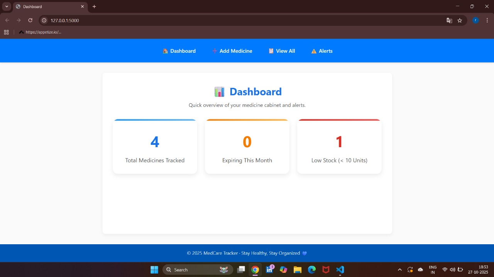
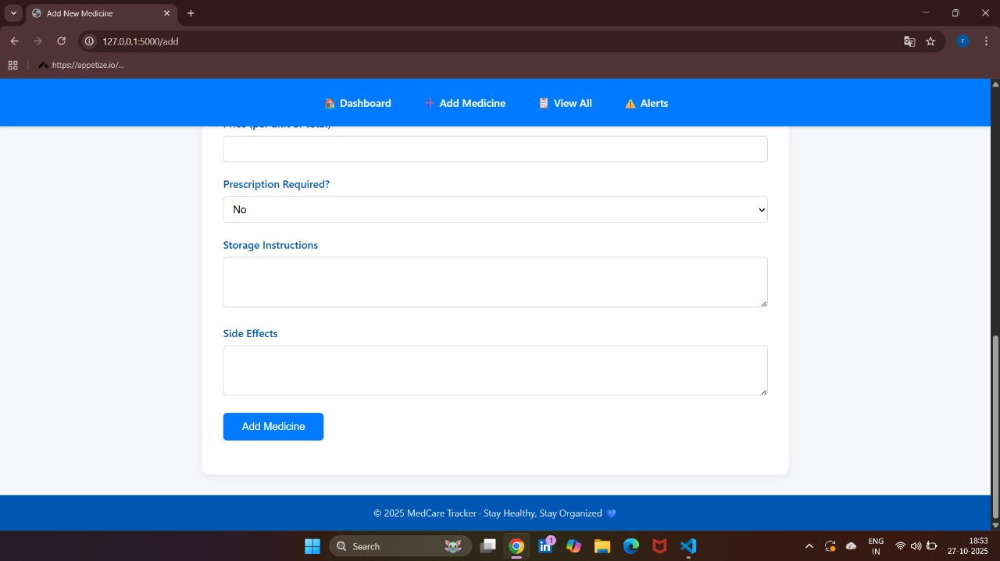
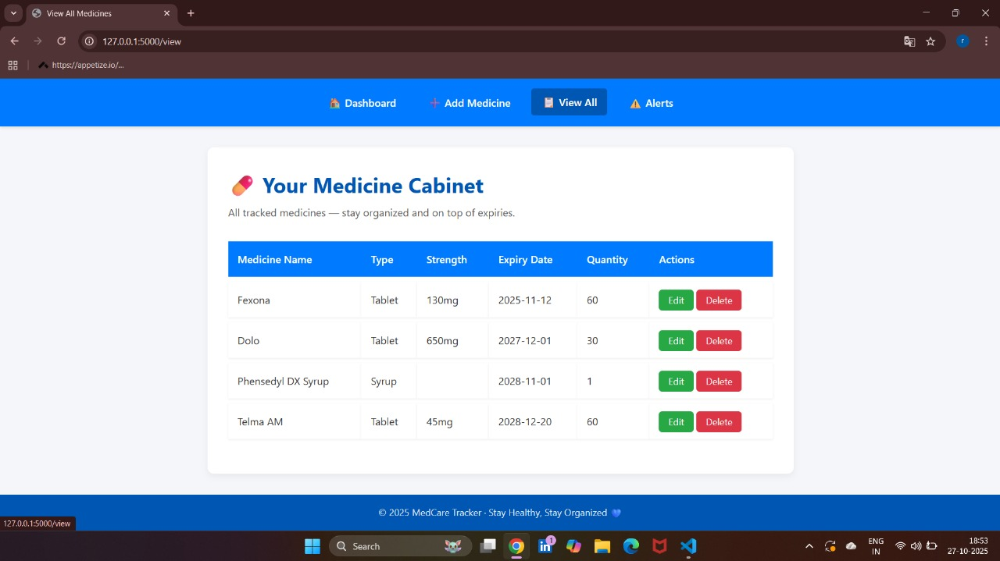

💊 Medicine Tracker

A simple and elegant Flask-based web app to track your medicines, manage reminders, and view your daily schedule — all in one place.

🚀 Features
✅ Add, edit, and delete medicines
✅ View all medicines in a clean dashboard
✅ Set alerts and reminders
✅ Uses SQLite for lightweight data storage
✅ Built with Flask, HTML, CSS, and Bootstrap/Tailwind

🧠 Tech Stack

Category	     Technology
Backend	         Flask (Python)
Frontend	     HTML, CSS, Bootstrap
Database	     SQLite
Version Control	 Git + GitHub
Environment	     Virtualenv

🛠️ Installation & Setup

1. Clone the Repository
   git clone https://github.com/rushabhchopda3-a11y/Medicine-Tracker.git
   cd Medicine-Tracker

2. Create a Virtual Environment
   python -m venv venv
   venv\Scripts\activate

3. Install Dependencies
   pip install -r requirements.txt

4. Run the App
   python app.py

5. Open in Browser
   http://127.0.0.1:5000

🏠 Dashboard

➕ Add Medicine Page

⏰ Reminder View

View page

👨‍💻 Author
Rushabh Chopda
📧 rushabhchopda3@gmail.com

⭐ Contribute
Pull requests are welcome!
If you’d like to improve the project (UI, database, or functionality), feel free to fork and submit your ideas.

🧡 Support
If you like this project, please give it a ⭐ on GitHub — it helps others discover it!